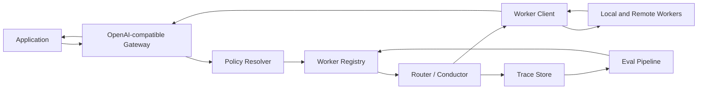

# Architecture Draft

This is a working architecture, not a final implementation contract.

## Components

## Request Flow

1. An application sends an OpenAI-compatible request to OpenFugu.
2. The gateway normalizes the request and loads the active policy.
3. The registry returns eligible workers and capability profiles.
4. The router or conductor selects a worker plan.
5. Worker clients call local or remote model endpoints.
6. The gateway returns an OpenAI-compatible response.
7. OpenFugu stores a trace for inspection and evaluation.

## Initial Module Boundaries

### Gateway

Responsibilities:

- expose OpenAI-compatible endpoints
- validate request shape
- attach policy context
- normalize response shape
- avoid leaking internal orchestration details unless trace output is requested

### Worker Registry

Responsibilities:

- store worker endpoints
- store capability profiles
- track health status
- expose eligible workers to the router

### Policy Resolver

Responsibilities:

- load default and request-specific policy
- enforce privacy, provider, budget, and latency constraints
- remove disallowed workers before routing

### Router

Responsibilities:

- classify request intent
- score eligible workers
- select worker or worker plan
- emit a decision object with reasons

### Worker Client

Responsibilities:

- call OpenAI-compatible workers
- adapt non-compatible providers later if needed
- collect latency, token, and error data
- normalize failure signals for fallback

### Trace Store

Responsibilities:

- record routing inputs, decisions, and outcomes
- support inspection
- support eval data export
- redact sensitive content based on policy

## Deployment Shapes

OpenFugu should support multiple deployment styles:

- local developer gateway
- Docker service on a workstation or server
- team intranet service

The first open-source implementation should prioritize local and Docker usage.

## Interface Principle

Applications should be able to point existing OpenAI-compatible clients at
OpenFugu with minimal changes. Advanced orchestration controls can be added
through headers, request metadata, or policy names.
